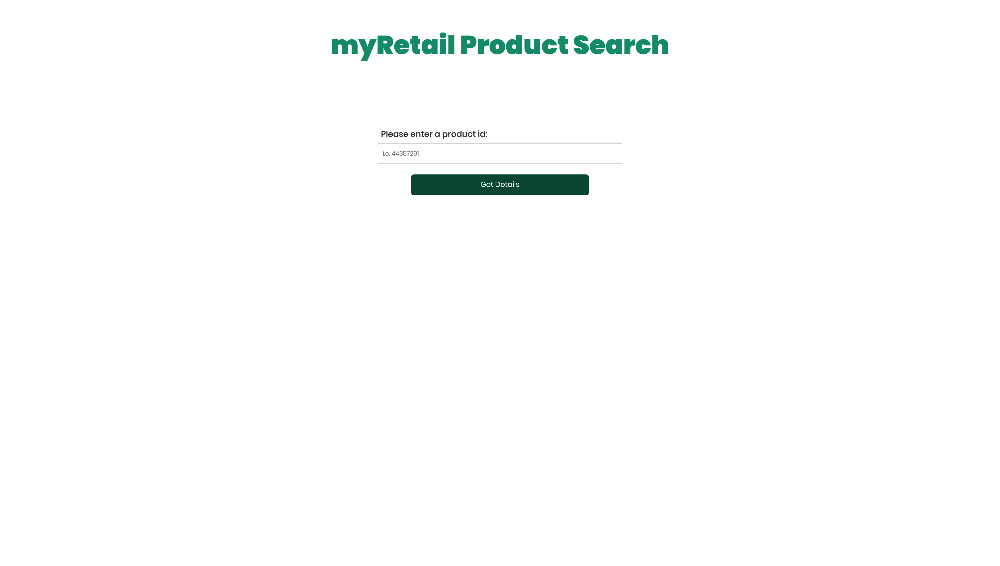
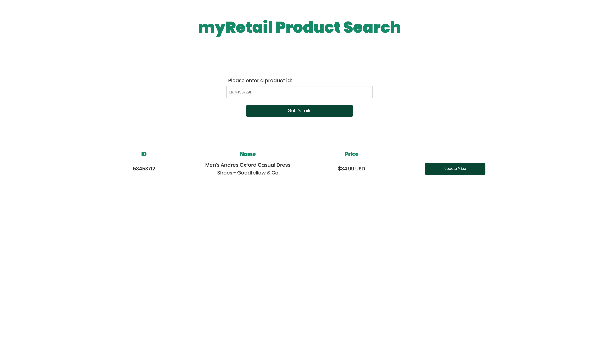

# myRetail Product Search
-----------------------
This application allows a user to search for a product's name and price from the 8-digit product ID.  The information is pulled from the Target RedSky API as well as a NoSQL data store. [HEROKU LINK]

## Built With
> + JavaScript
> + React
> + Redux
> + axios
> + Node.js
> + Express
> + Mongoose

### Getting Started
-----------------------
Get the application up and running locally.

### Prerequisites
These downloads are required before starting the application.

> + [ Node.js ] (https://nodejs.org/en/)
> + [ MongoDB ] (https://docs.mongodb.com/)
> + [ Studio 3T ] (https://studio3t.com/download/)

### Installing
Steps to get the development environment running.

1. Download this project.
2. Open Studio 3T and create connection at port 27017
3. npm install
4. npm run client
5. mongod
6. npm run server

## Site Views
-----------------------
#### Home Page

#### Search Results

### Test Data
-----------------------
This project was created as a Proof-Of-Concept and therefore is only storing price data for 7 products.  Copy and paste the following into the Studio 3T IntelliShell window and execute, then use these product IDs to perform searches from the website.
> db.products.insertOne({productId: 13860429, price: 10.00, currenyCode: 'USD'})
> db.products.insertOne({productId: 13860431, price: 6.00, currenyCode: 'USD'})
> db.products.insertOne({productId: 53871305, price: 14.99, currenyCode: 'USD'})
> db.products.insertOne({productId: 14778667, price: 23.99, currenyCode: 'USD'})
> db.products.insertOne({productId: 53453712, price: 34.99, currenyCode: 'USD'})
> db.products.insertOne({productId: 53187753, price: 2.99, currenyCode: 'USD'})
> db.products.insertOne({productId: 53439166, price: 59.99, currenyCode: 'USD'})

### Next Steps
-----------------------
Features to be added in continued developement:
+ [ ] If a product exists in RedSky, check for existing database entry for search results. If no entry exists, prompt user to enter price and currency code to add this product information to the database for future searches
+ [ ] Display an image that corresponds to the product ID in the search results
+ [ ] Search for the products by name as well as ID.
+ [ ] Display the results from the last 5 searches in addition to the most recent search to allow the user to see previous search results

## Authors
Rachel Peddie